Aqui está um fluxograma com base nos passos fornecidos sobre "Censura e perseguição contra a direita no judiciário brasileiro":

## Censura e perseguição contra a direita no judiciário brasileiro

  - Censura e perseguição
    - O que é censura?
      - Restrição à liberdade de expressão.
      - Controle e proibição de informações.
    - O que é perseguição?
      - Ato de hostilizar ou discriminar alguém por suas opiniões políticas.
      - Prática de punir ou prejudicar indivíduos por suas ideias.
    - Exemplos de censura e perseguição contra a direita no judiciário brasileiro
      - Casos emblemáticos de censura.
      - Processos judiciais motivados por posicionamentos políticos conservadores.
      - Exclusão e marginalização de vozes da direita no ambiente jurídico.
      - Manipulação do sistema judiciário para silenciar a direita.
  - Motivações por trás da censura e perseguição
    - Violação da liberdade de expressão
      - Restrição de opiniões divergentes do pensamento dominante.
      - Supressão da diversidade de ideias.
    - Interesses e pressões políticas
      - Ações com motivações partidárias.
      - Desprezo pela imparcialidade e independência judicial.
  - Consequências da censura e perseguição
    - Enfraquecimento da democracia
      - Diminuição das vozes e pluralidade política.
      - Amordaçamento do dissenso.
    - Perda da confiança no judiciário
      - Descrença nas instituições.
      - Prejuízo à legitimidade e imparcialidade da justiça.
    - Desequilíbrio no sistema jurídico
      - Ajuste da balança em favor de determinadas ideologias.
      - Prejudica a conquista de um sistema judiciário justo.
  - Desafios e soluções para combater a censura e perseguição
    - Fortalecimento da independência judicial
      - Garantia da imparcialidade e autonomia dos juízes.
      - Proteção contra pressões políticas.
    - Apoio à liberdade de expressão
      - Promoção da diversidade de opiniões.
      - Proteção do direito de manifestação e expressão.
    - Monitoramento e denúncia de casos de censura
      - Visibilidade para violações de direitos fundamentais.
      - Responsabilização dos responsáveis pelas restrições.
    - Busca pela conscientização e informação
      - Educação sobre os princípios democráticos e direitos fundamentais.
      - Engajamento na defesa da democracia e liberdade.

```mermaid
flowchart TD
    A[Censura e perseguição contra a direita no judiciário brasileiro] --> B[Censura e perseguição]

    B --> C[O que é censura?]
    C --> C1[Restrição à liberdade de expressão.]
    C --> C2[Controle e proibição de informações.]

    B --> D[O que é perseguição?]
    D --> D1[Ato de hostilizar ou discriminar alguém por suas opiniões políticas.]
    D --> D2[Prática de punir ou prejudicar indivíduos por suas ideias.]

    B --> E[Exemplos de censura e perseguição contra a direita no judiciário brasileiro]
    E --> E1[Casos emblemáticos de censura.]
    E --> E2[Processos judiciais motivados por posicionamentos políticos conservadores.]
    E --> E3[Exclusão e marginalização de vozes da direita no ambiente jurídico.]
    E --> E4[Manipulação do sistema judiciário para silenciar a direita.]

    A --> F[Motivações por trás da censura e perseguição]
    F --> G[Violação da liberdade de expressão]
    G --> G1[Restrição de opiniões divergentes do pensamento dominante.]
    G --> G2[Supressão da diversidade de ideias.]

    F --> H[Interesses e pressões políticas]
    H --> H1[Ações com motivações partidárias.]
    H --> H2[Desprezo pela imparcialidade e independência judicial.]

    A --> I[Consequências da censura e perseguição]
    I --> J[Enfraquecimento da democracia]
    J --> J1[Diminuição das vozes e pluralidade política.]
    J --> J2[Amordaçamento do dissenso.]

    I --> K[Perda da confiança no judiciário]
    K --> K1[Descrença nas instituições.]
    K --> K2[Prejuízo à legitimidade e imparcialidade da justiça.]

    I --> L[Desequilíbrio no sistema jurídico]
    L --> L1[Ajuste da balança em favor de determinadas ideologias.]
    L --> L2[Prejudica a conquista de um sistema judiciário justo.]

    A --> M[Desafios e soluções para combater a censura e perseguição]
    M --> N[Fortalecimento da independência judicial]
    N --> N1[Garantia da imparcialidade e autonomia dos juízes.]
    N --> N2[Proteção contra pressões políticas.]

    M --> O[Apoio à liberdade de expressão]
    O --> O1[Promoção da diversidade de opiniões.]
    O --> O2[Proteção do direito de manifestação e expressão.]

    M --> P[Monitoramento e denúncia de casos de censura]
    P --> P1[Visibilidade para violações de direitos fundamentais.]
    P --> P2[Responsabilização dos responsáveis pelas restrições.]

    M --> Q[Busca pela conscientização e informação]
    Q --> Q1[Educação sobre os princípios democráticos e direitos fundamentais.]
    Q --> Q2[Engajamento na defesa da democracia e liberdade.]
```
   

